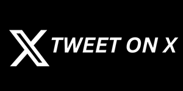
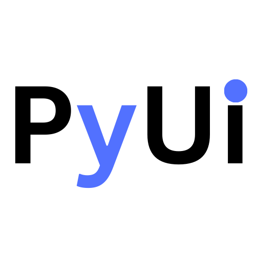

# PyUIBuilder - The only Python GUI builder you'll ever need

    
    
    
    

Build Python GUI's like Canva.

https://github.com/user-attachments/assets/ac91aa98-843d-4578-b646-88e66bc113de

**Don't like background music? fell free to mute it**

## Try PyUIBuilder
Try [PyUIBuilder](https://pyuibuilder.pages.dev/)

## Table of contents

- [Docs - Getting started](#docs---getting-started)
- [Features](#features)
- [Supported Frameworks/Libraries](#supported-frameworkslibraries)
- [Roadmap](#roadmap)
- [License - Fund the development](#license---fund-the-development)
- [Newsletter](#newsletter)
    - [Keep yourself updated](#keep-yourself-updated)
- [Tested on](#tested-on)
- [FAQ](#faq)
- [License Information](#license-information)
    - [Web based Editor](#webbased-editor)
    - [Electron App - Hobbyist License](#electron-app---hobbyist-license)
    - [Electron App - Commercial License](#electron-app---commercial-license)
- [Some of my other open-source](#some-of-my-other-open-source)
- [Author](#author)

## Docs - Getting started
Read the docs on the [Docs page](https://pyuibuilder-docs.pages.dev/)

## 3 Easy steps.
1. Select a UI library/framework.
2. Drag and drop widgets.
3. Generate and download the code.

## Features

While there are a lot of features, here are few you need to know.

* Framework agnostic - Can outputs code in multiple frameworks.
* Easy to use.
* Pre-built UI widgets
* Plugins to extend 3rd party UI libraries
* Generates Code.

## Supported Frameworks/Libraries

- [x] Tkinter 
- [x] CustomTkinter 
- [ ] Kivy (work in progress)
- [ ] PySide (work in progress)

## Roadmap
Here are some of the upcoming features.
* Treeview on the sidebar
* Support for Event Handlers
* Kivy Framework support
* Pyqt/PySide Support
* **Downloadable Electron app** and more.

To learn more/ see upcoming features visit [roadmap](./roadmap.md)
 
To stay in loop, subscribe to the free [newsletter](https://paulfreeman.substack.com/subscribe?utm_source=Github-Pybuilder)

## License - Fund the development

Help fund open-source work and development of this and upcoming projects by purchasing a one-time license.

Purchasing License will allow me to focus on development of this tool and provide you access to more advance features, early access and more.

The discount's will be available for limited time only on pre-orders.

| Type                                                              | Free              | Premium - Hobbyist / Per user                            | Premium - Commercial / Per user                            |
|-------------------------------------------------------------------|-------------------|----------------------------------------------------------|------------------------------------------------------------|
| **Support open-source development**                               | 👍️                 | 😎                                                        | 🚀                                                          |
| **Priority support** - (prioritize your feature requests, issues) | community support | ✅                                                        | ✅                                                          |
| **Lifetime license** (one-time  purchase)                         | 👍️                 | ✅                                                        | ✅                                                          |
| **Early access** to upcoming features                             | ❌                 | ✅                                                        | ✅                                                          |
| **Downloadable Electron App** (upcoming)                          | ❌                 | ✅                                                        | ✅                                                          |
| **Run Preview live**(upcoming)                                    | ❌                 | ✅                                                        | ✅                                                          |
| **Save and Load UI files** (upcoming)                             | ❌                 | ✅                                                        | ✅                                                          |
| **Load 3rd party plugins locally**                                | ❌                 | ✅                                                        | ✅                                                          |
| **Dark theme** (upcoming)                                         | ❌                 | ✅                                                        | ✅                                                          |
| **Commercial Use**                                                | ✅                 | ❌                                                        | ✅                                                          |
| **Support for PyQt/PySide frameworks** (upcoming)                 | ❌                 | ❌                                                        | ✅                                                          |
| **More upcoming features and support**                            | ❓️                 | ✅                                                        | ✅                                                          |
| **Price**                                                         | -                 | ~~$129~~ **$29** (save 77.52% for limited time on pre-order) | ~~180~~ **$49** (Save 72.78% for a limited time on pre-orders) |
| Pre-order now!                                                    |                   | [Get license](https://ko-fi.com/s/4a3dffb3b9)                                          | [Get license](https://ko-fi.com/s/560a3b6b05)                                            |

## Newsletter

Join the free newsletter to know about upcoming updates, learn how I built this tool and more about open-source.

[Join free newsletter](https://paulfreeman.substack.com/subscribe?utm_source=Github-Pybuilder)

#### Keep yourself updated

To keep up with the latest developments considering starting ⭐️ this repo

## Tested on

Depending on whether your Browser supports native HTML drag and drop, it may work differently.
I haven't tested on Safari, since I don't have a Macbook, feel free to let me know if it works.

- [x] Chrome
- [x] Edge
- [x] FireFox
- [ ] Safari (Not tested on safari)

## FAQ

1. **Why do I need a GUI builder?**
    
    **A.** GUI builders assist you quickly create GUI without learning too much about GUI frameworks. It can also help you quickly prototype and see things visually. 

2. **Do I need to purchase a license to use this?**

   **A.** Webbased editor will remain free to use. To support open-source development, If you want a downloadable exe for local development and additional features, you'll need to purchase license based on your needs (hobbiest / commercial)

3. **How does this compare to other UI builders?**

   **A.** 
   * Most GUI builders out there are framework specific, this UI Builder tool is framework independent.

   * This outputs code in Python, not in XML or other formats which can be hard to debug. So its easier to modify even after downloading the code.

   * Support for 3rd party UI libraries. Many GUI builders don't come with support for 3rd party libraries. 

4. **Why doesn't the theme of the GUI builder match the theme of Tkinter?**
   
   **A.** Tkinter is a OS-dependent library, so it would render differently on different OS. Having a common UI the the GUI builder makes it simpler for development. 
   
   If you want a live preview before generating the code you can get a premium license and you'll be notified when that feature releases.

## License Information

To support development of this project, license differ depending on the usecase.

#### Webbased Editor
* All code generated by the builder tools  are licensed under MIT and can be used commercially

#### Electron App - Hobbyist License
This is meant for students and hobbyist
* All code generated by the builder tools are free to use for non-commercial purposes. If you are using 
  this for a startup or your business you'll need to get a business license.

#### Electron App - Commercial License
This is meant for business usecases, you can use the code even for commercial use.
* All code generated by the builder tools are free to use for commercial and non-commercial purposes. If you are using this for a startup or your business you'll need to get a commercial license.

## Some of my other open-source

* [Awesome Landing pages](https://github.com/PaulleDemon/awesome-landing-pages)
* [Hover Preview](https://github.com/PaulleDemon/Hover-Preview)
* [Font Tester](https://github.com/PaulleDemon/font-tester-chrome)
* [Django SaaS Boilerplate](https://github.com/PaulleDemon/Django-SAAS-Boilerplate)

## Author
* Paul
* Github: PaulleDemon
