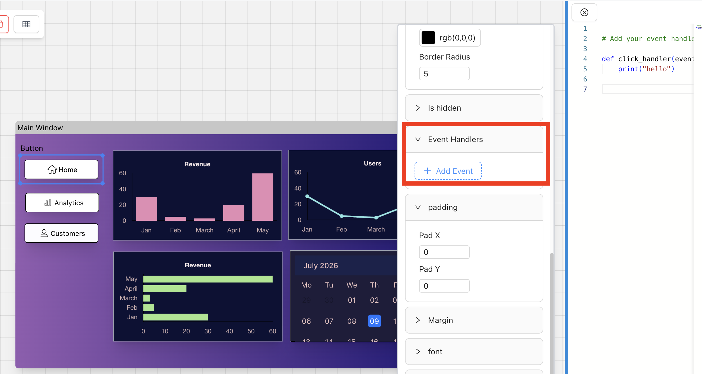

# Event handlers

Event handlers are functions that are executed when a event takes place. Eg: when a button is clicked, or hovered or key is clicked.

# Adding Event handlers in Pyuibuilder



* To add event handler, click on a widget -> properties panel -> scroll to event handler
* Now click on add event, and select the event from the first drop down and handler from second dropdown.


## Writing a handler

Select the **Code Editor** tab, then a widget's event, to get a Python function stub you fill in:

```python
# Add your event handler
def click_handler(event):
    print("hello")
```

The handler is plain Python — write whatever logic you need, the same as you would in a hand-written script.

## Where handlers end up

When you export your project, the handler functions you've written are included in the generated code and wired up to the corresponding widget events automatically.

> **Note:** The exact list of events available per widget (click, change, hover, etc.) isn't covered in this doc yet — if you're filling this page in further, list them here per widget type.