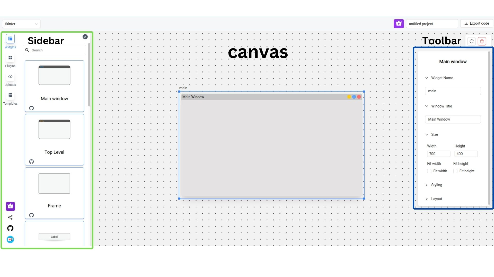
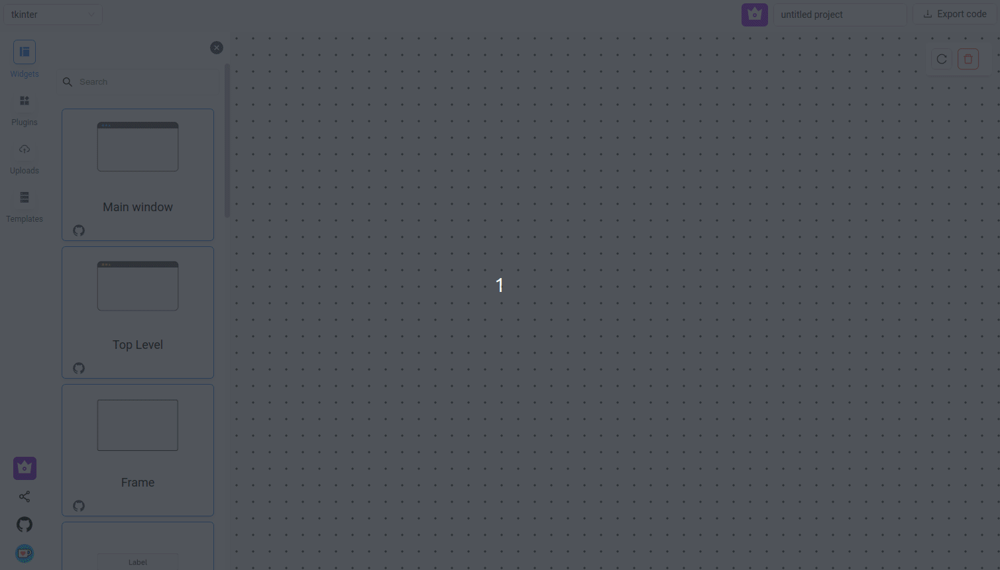
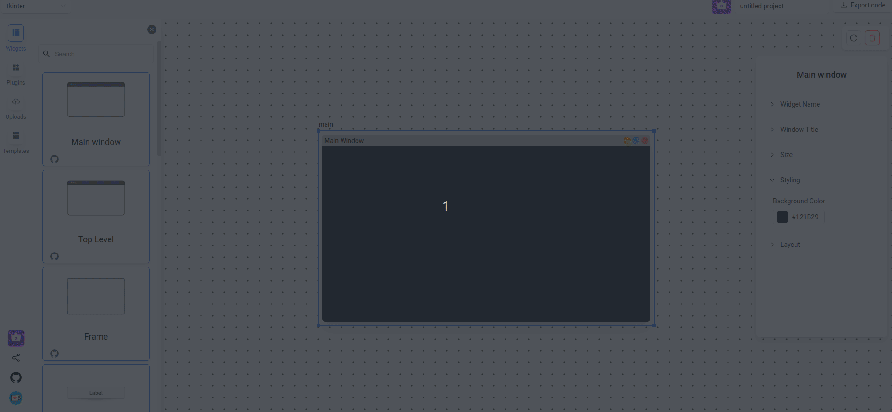
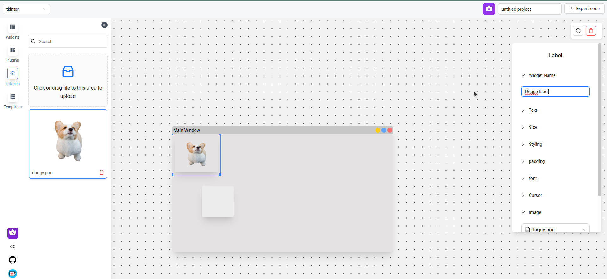
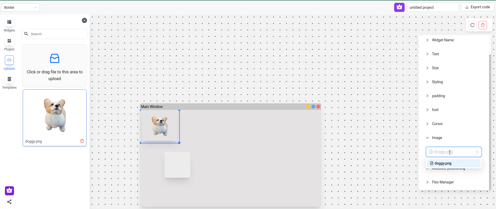
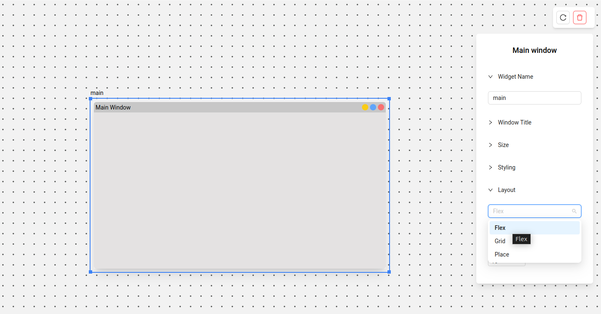
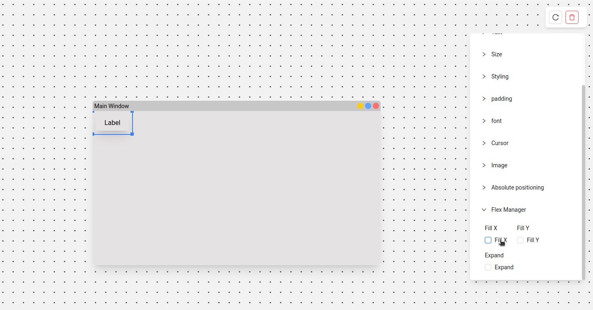
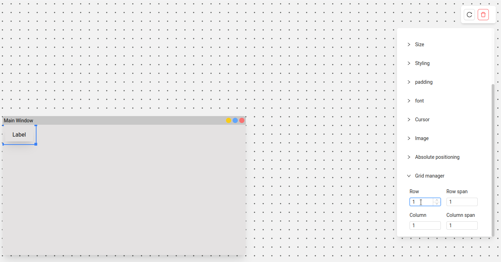
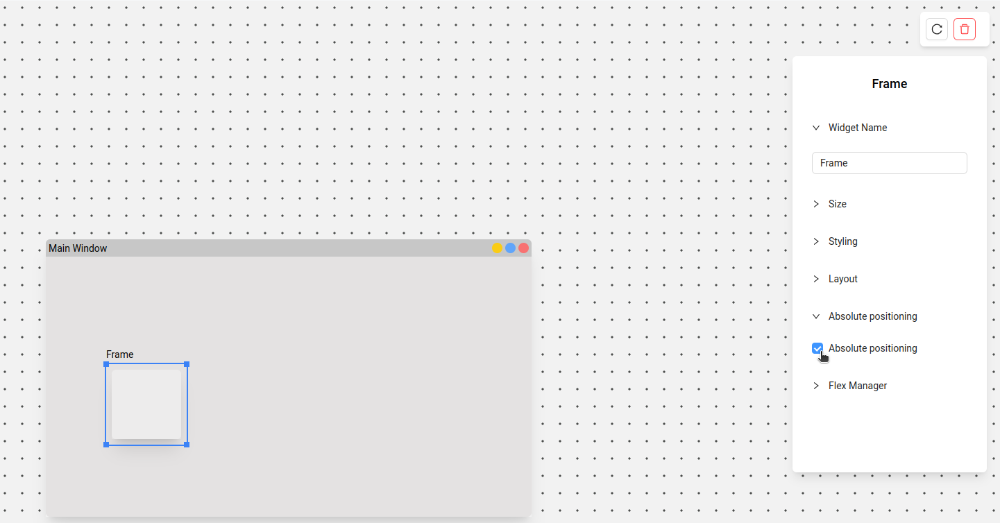

# PyUIBuilder Documentation

  
NOTE ⚠️

  Work in progress. This page will be updated from time to time. This contains the basic documentation for PYUIBuilder

## UI Basics
Let's start with the basics of UI

1. The sidebar on the left will have multiple buttons, each button will provide you with necessary tools.
2. The Place where you drag and drop widgets is the canvas
3. The toolbar will only appear if a widget is selected.

## Canvas

Things you can do on canvas.

1. Add widgets from sidebar.
2. Zoom and pan using mouse.
3. zoom using `+`/`-` keys
4. Delete widgets using `del` key or right clicking on the widget

## Widgets

Every widget has its own attributes, some of the attributes may be common.

1. **MainWindow:** Every UI needs to have one main window. If you don't have any main window, the output will not be generated. 
   
   If you have multiple Main Window you'll be asked to delete one window at the time of code generation.

2. **Layouts:** Every widget that can hold a child widget has three different layouts.

   1. Flex(also known as pack)
   2. Grid
   3. Absolute/Place
   
   The parents of the child widgets controls the layout. The layout properties such as grid position will be available to the child under the grid-manager/flex-manager section.

All Widgets attributes are available on the toolbar. 
The toolbar contains collapsible, which can be opened to modify the widgets attributes such 
as foreground / background colors, themes and more.

### Adding widgets

Adding widgets are as easy as dragging and dropping widgets from sidebar to canvas

### Deleting widgets

You can either delete the widget by selecting the widget and pressing the `del` button
or right-click -> delete

### Variable names

To modify variable name, change the widget name attributes, if there are duplicate names, 
the code generation engine will automatically add a count. Every widget name will be converted
to snake case.

### Modifying widget attributes

Widget attributes are available will selected on the toolbar.

### Adding images to label

To add image to label first go to sidebar -> uploads -> upload a image file.

Now under the label attributes you'll be able to see image upload option. Select the image from the dropdown

## Layouts

There are 3 main layouts. The layouts are set by the parents. Once a layout is set 
every child widget will use the same layout for positioning. The ony exception is if 
you have enabled absolute positioning from the child widgets toolbar.

Depending on the layout selected your child widgets will be provided with 
flex-manager / grid-manager.

### Flex
Flex is similar to pack in tkinter, the widgets will be arranged horizontally/vertically
depending on the flex-direction

### Grid
Grid is a 2d layout manager, you can position each widget by clicking on widget -> toolbar -> grid-manager

### Absolute positioning
You can use position absolute for specific widget by checking the absolute positing attribute

