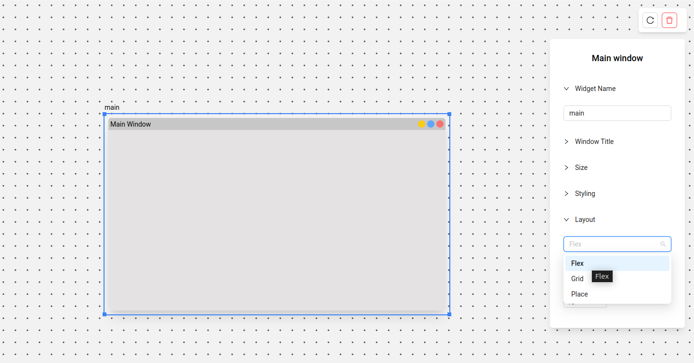
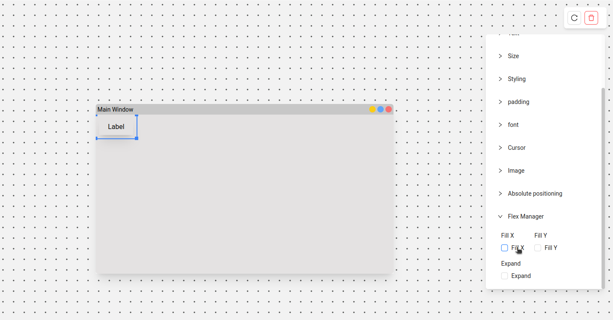
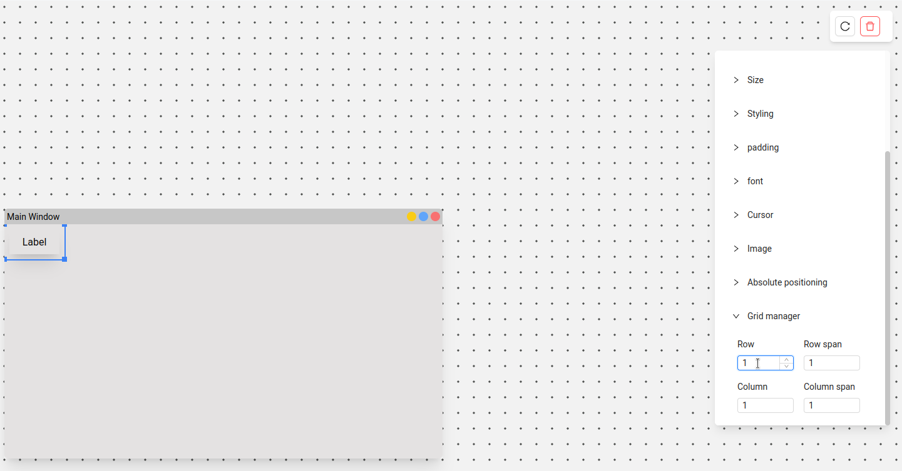
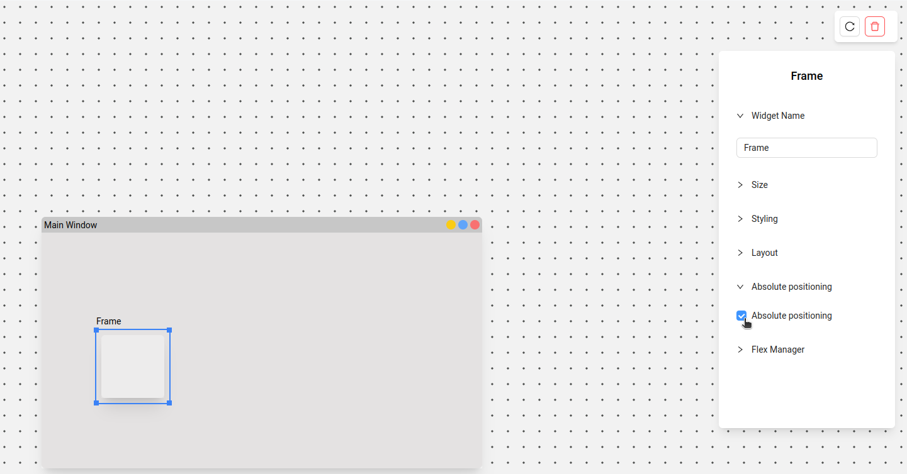

# Layouts

There are three layout modes. The layout is set by the **parent** widget — every child uses that layout for positioning, unless you enable absolute positioning individually on that child from its own toolbar.

By default, all containers use **Flex**.

Depending on the layout selected, child widgets get a matching **flex-manager** or **grid-manager** section in their attributes.

## Flex

Similar to `pack` in Tkinter — widgets are arranged horizontally or vertically depending on the side you choose, and you can use anchor to position within that side.

Further reading: [Understanding how `pack` works](https://www.youtube.com/watch?v=rbW1iJO1psk)

## Grid

A 2D layout manager. Position each child widget via widget → toolbar → **grid-manager**. On the parent, you'll also need to define the number of rows/columns (grid configure) and the grid weight.

## Absolute positioning

Enable the **absolute positioning** attribute on a specific widget to take it out of the parent's layout flow and position it by exact coordinates instead.

## Grid snapping

Grid snapping is a separate, canvas-wide aid for precise placement — not one of the three layout modes above. It applies while you're dragging widgets around, regardless of which layout mode the parent uses. See [UI basics → Grids and snapping](ui-basics.md#grids-and-snapping) for how to enable it and adjust grid size.