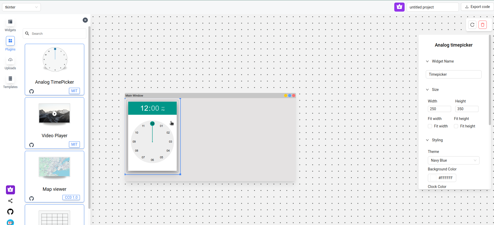

# Plugins & templates

## Plugins

Plugins are third-party UI libraries. You drag and drop them onto the canvas exactly like built-in widgets. Each plugin's card in the sidebar shows information about the library — including a link to its repo and license.

This is how PyUIBuilder stays framework-agnostic while still supporting rich, specialized widgets (charts, maps, calendars, and similar) without bundling every possible library into the core builder.

## Templates

The **Templates** tab in the sidebar lets you start a project from a pre-built layout instead of an empty canvas — useful for common screens (dashboards, forms, etc.) you don't want to lay out from scratch every time.

## Premium widgets

Some widgets and plugins are marked with a small crown icon and require a paid plan. See [FAQ](faq.md#login-and-license-faq) for how licenses and logins work.