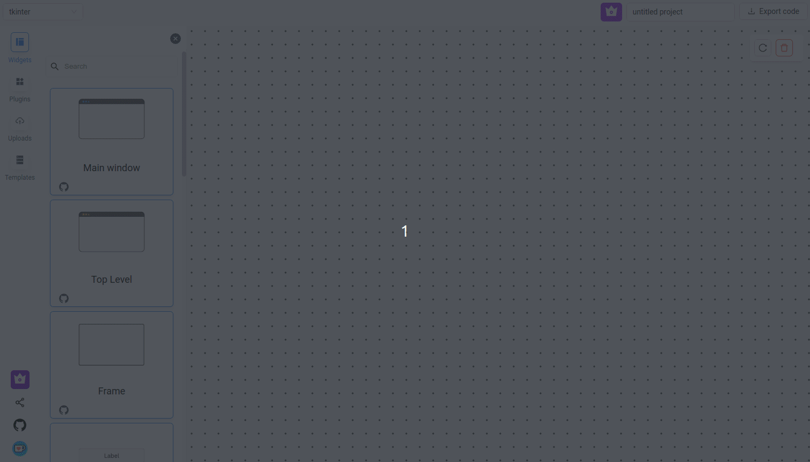
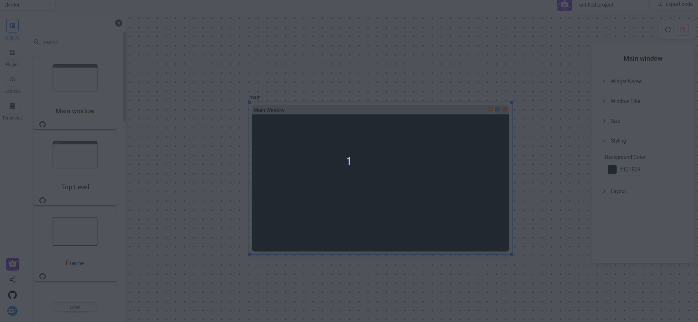
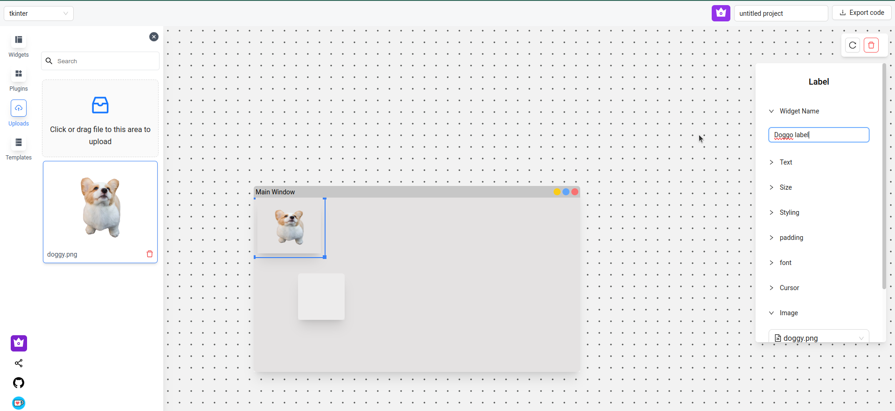
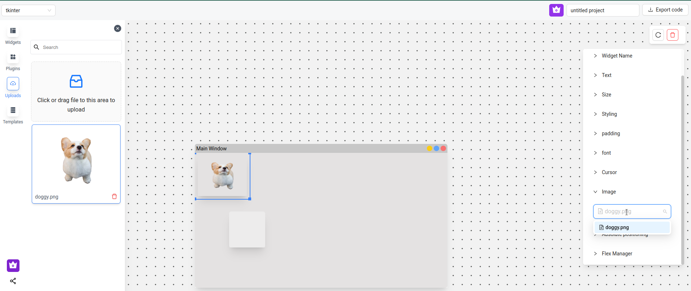
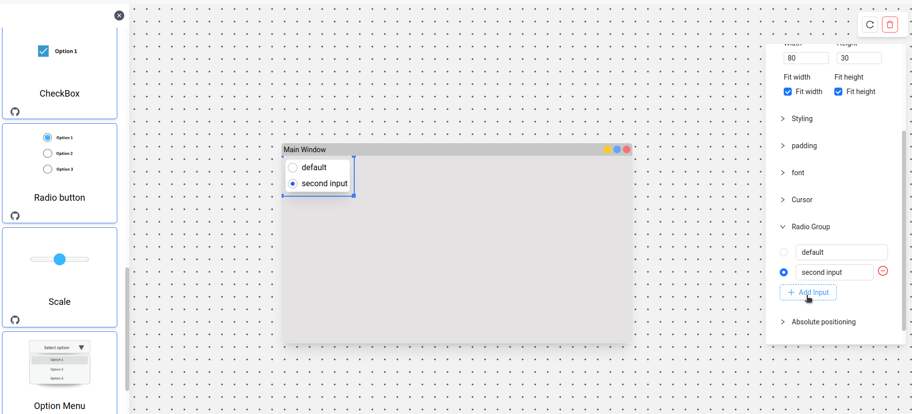
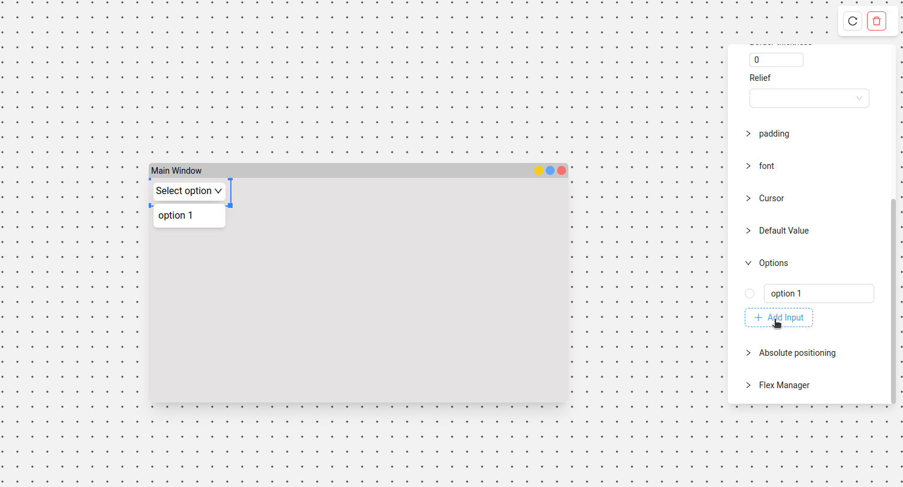

# Widgets

Every widget has its own attributes; some attributes are shared across widget types.

## Main window

Every project needs exactly one **Main window** widget — without it, code generation won't run. If you end up with more than one (e.g. after copy-pasting between projects), you'll be asked to delete one at export time.

Other structural widgets you'll find in the **Widgets** tab include **Top Level** (a secondary window/dialog) and **Layout manager** (a container for grouping and positioning child widgets) — see [Layouts](layouts.md).

> Some widgets are marked with a small crown icon — these are premium widgets, available on a paid plan. See [FAQ](faq.md#login-and-license-faq) for how licensing works.

Widget cards in the sidebar also link out (via the GitHub icon) to the source of the underlying widget library where relevant — handy if you want to check the widget's own docs or license.

## Layouts

Every widget that can hold a child widget supports three layout modes — **Flex**, **Grid**, and **Absolute/Place**. The layout is set on the *parent*; every child follows it. Full details: [Layouts](layouts.md).

All widget attributes — including layout-specific ones like grid position — are available on the toolbar when the widget is selected.

## Adding widgets

Drag a widget from the sidebar onto the canvas:

## Deleting widgets

Select the widget and press `Del`, or right-click it and choose delete:

## Resizing widgets

Drag a widget's corners to resize it. If **fit-width** / **fit-height** is enabled on that widget, uncheck it first — otherwise the widget will keep snapping back to its content size.

## Variable names

Change a widget's name from its name attribute. If two widgets end up with the same name, the code generation engine automatically appends a count (`var1`, `var2`, ...). Every widget name is converted to snake_case in the generated code.

## Modifying widget attributes

Attributes for the selected widget appear on the toolbar:

## Adding an image to a label

1. Go to the sidebar → **Uploads** → upload an image file.
2. Select the label widget → in its attributes, find the image option → choose the uploaded image from the dropdown.

## Adding image to Button

[Simlar to adding images to label, refer above]

## Adding options to a radio button

Select the radio button widget → toolbar → **radio group** → **add input**.

## Adding options to a select dropdown

Same process as radio buttons above.

